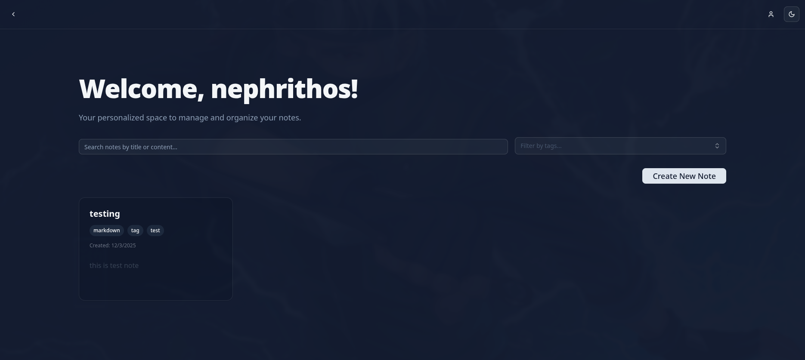

# Markdown Notes

A full-stack notes application with multi-user accounts, relational tagging and JWT authentication delivered over HttpOnly cookies. React + TypeScript frontend, Django REST Framework backend.



---

## Why this project exists

I wanted to work through a complete authenticated full-stack app rather than another CRUD demo — specifically, to solve token storage properly instead of dropping a JWT into `localStorage` and hoping for the best.

The result is a session model where **the browser never touches the token**. Access and refresh tokens are issued as HttpOnly cookies and read server-side by a custom DRF authentication class, so a successful XSS attack can't exfiltrate credentials.

---

## Features

- **Multi-user accounts** — registration, login, logout, per-user note isolation
- **JWT in HttpOnly cookies** — tokens never exposed to JavaScript
- **Relational tagging** — `Tag` is a real model with a many-to-many relationship, not a JSON blob
- **User profiles** — with a first-run setup flow
- **Search and filtering** — by title, content and tag
- **Dark mode** — CSS-variable theming through Tailwind
- **Typed end to end** — TypeScript on the frontend, type hints and docstrings on the backend

---

## Architecture

### Authentication flow

```
POST /api/token/          → MyTokenObtainPairView
                            ├─ validates credentials
                            ├─ sets access_token  cookie (HttpOnly, SameSite=Lax)
                            └─ sets refresh_token cookie (HttpOnly, SameSite=Lax)

Any authed request        → CustomJWTAuthentication
                            ├─ reads the token from the cookie, not the Authorization header
                            ├─ raises InvalidToken on expiry → DRF returns 401
                            └─ frontend interceptor catches 401 and refreshes silently
```

`CustomJWTAuthentication` subclasses SimpleJWT's `JWTAuthentication` and overrides token extraction. Cookie names, lifetimes, `Secure`, `SameSite` and domain all come from the `SIMPLE_JWT` block in settings, so production hardening is configuration rather than a code change.

### Data model

| Model | Notes |
|---|---|
| `Tag` | Unique indexed name, ordered alphabetically |
| `Notes` | FK to `User`, M2M to `Tag`, title + content, timestamps |
| `UserProfile` | Created via `post_save` signal, tracks `is_profile_setup_completed` |

All user-facing strings use `gettext_lazy`, so the app is translation-ready.

---

## Tech stack

**Frontend** — React 18, TypeScript, Vite, Tailwind CSS, shadcn/ui, Lucide
**Backend** — Django 5.2, Django REST Framework 3.16, SimpleJWT 5.5, SQLite (dev)

---

## Getting started

**Prerequisites:** Node 18+ with Yarn, Python 3.10+

### 1. Clone

```bash
git clone https://github.com/Nephrithos/Notes.git
cd Notes
```

### 2. Backend

```bash
cd notes_backend
python -m venv venv
source venv/bin/activate          # Windows: venv\Scripts\activate
pip install -r requirements.txt

cp .env.example .env.local        # then fill in the values
python manage.py migrate
python manage.py createsuperuser
python manage.py runserver
```

API runs at `http://localhost:8000`.

Generate a secret key for `.env.local` with:

```bash
python -c "from django.core.management.utils import get_random_secret_key; print(get_random_secret_key())"
```

### 3. Frontend

In a second terminal:

```bash
cd notes_frontend
cp .env.example .env              # then set VITE_BACKEND_URL
yarn install
yarn dev
```

App runs at `http://localhost:5173`.

---

## Environment variables

**`notes_backend/.env.local`**

| Key | Example | Purpose |
|---|---|---|
| `SECRET` | *(generated)* | Django secret key |
| `DEBUG_STATE` | `True` | Debug mode — set `False` in production |
| `ALLOWED_HOSTS_LIST` | `127.0.0.1,localhost` | Comma-separated |
| `CORS_ALLOWED_CREDENTIALS` | `True` | Required for cookie auth |
| `CORS_ALLOWED_ORIGINS` | `http://localhost:5173` | Comma-separated |
| `CSRF_TRUSTED` | `http://localhost:5173` | Comma-separated |

**`notes_frontend/.env`**

| Key | Example |
|---|---|
| `VITE_BACKEND_URL` | `http://localhost:8000/api` |

---

## API

| Method | Endpoint | Purpose |
|---|---|---|
| `POST` | `/api/register/` | Create an account |
| `POST` | `/api/token/` | Log in — sets auth cookies |
| `POST` | `/api/logout/` | Clear auth cookies |
| `GET` | `/api/me/` | Current user |
| `GET`/`PATCH` | `/api/user/profile/` | Read or update profile |
| `GET`/`POST` | `/api/notes/` | List or create notes |
| `GET`/`PUT`/`DELETE` | `/api/note/<id>/` | Single note operations |
| `GET` | `/api/tags/` | List tags (read-only) |

---

## Project structure

```
Notes/
├── notes_backend/
│   ├── notes/                  # Django project config
│   │   └── settings.py
│   ├── notes_api/              # Application
│   │   ├── models.py           # Tag, Notes, UserProfile
│   │   ├── serializers.py
│   │   ├── views.py            # Auth + note/tag endpoints
│   │   ├── authentication.py   # CustomJWTAuthentication
│   │   └── urls.py
│   ├── manage.py
│   └── requirements.txt
└── notes_frontend/
    └── src/
        ├── components/
        │   ├── pages/          # Login, Register, HomePage, ShowNotes, NewNote, EditNote, Profile
        │   ├── forms/
        │   └── ui/             # shadcn/ui
        ├── context/AuthContext.tsx
        ├── services/           # api, auth, notes, user
        └── App.tsx
```

---

## Production notes

Before deploying, switch `AUTH_COOKIE_SECURE` to `True` (requires HTTPS), set `DEBUG_STATE=False`, set `AUTH_COOKIE_DOMAIN` to your frontend domain, move off SQLite, and serve through a WSGI server:

```bash
gunicorn notes.wsgi:application
```

---

## What I'd do next

- Markdown rendering with a live split-pane preview
- Note versioning and history
- Rate limiting on the auth endpoints
- Test coverage on the auth flow — the cookie handling is the part most worth guarding
- Deploy a live demo

---

## What I took from it

**Cookie-based JWT is more work than `localStorage` and worth it.** The awkward part isn't setting the cookie — it's the refresh cycle, CORS with credentials, and making the frontend interceptor retry cleanly on a 401 without creating a loop.

**shadcn/ui's copy-in model beats a dependency.** More setup, but the components are yours to modify and there's no upgrade treadmill.

**Modelling tags relationally rather than as a JSON field** cost an extra table and made filtering, uniqueness and renaming trivial instead of painful.

---

## License

MIT

---

Built by [Jarrod Smith](https://jarrodsmith.website)
